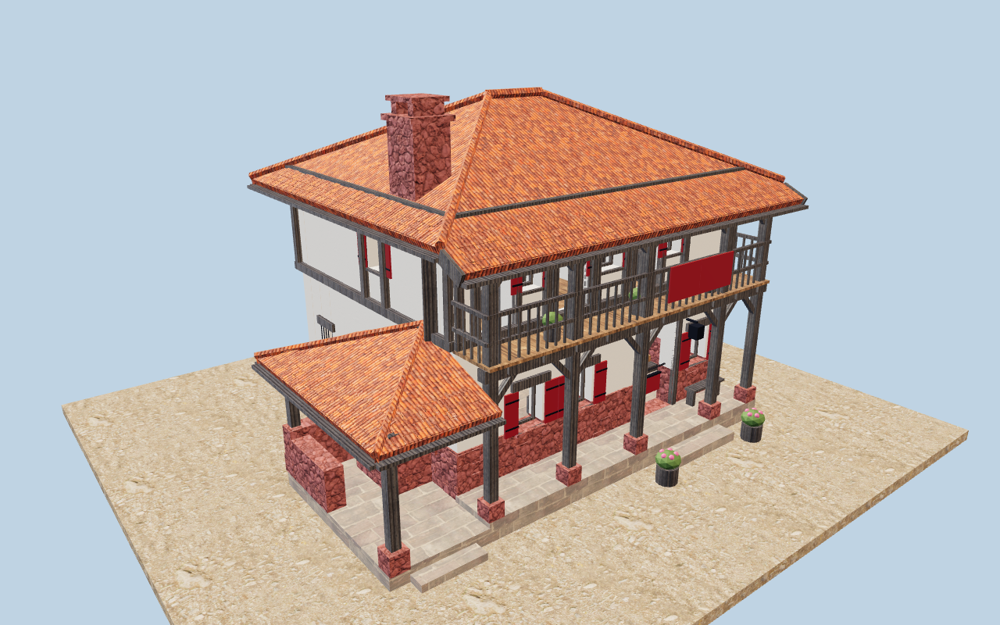
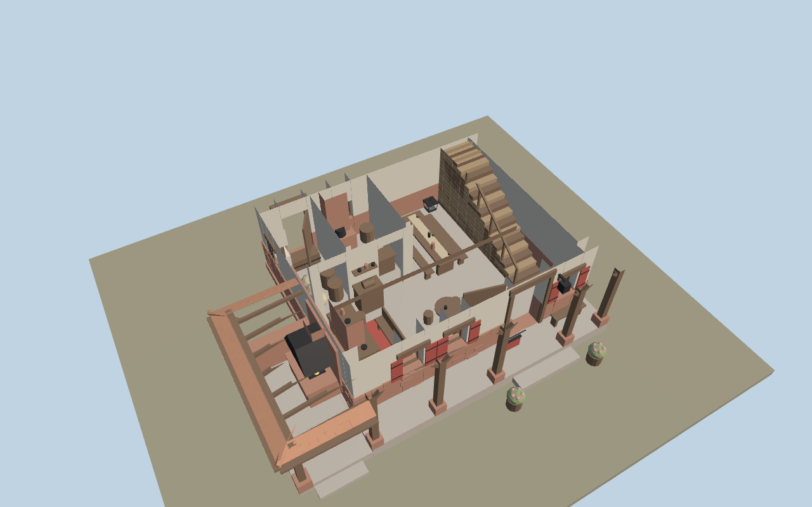
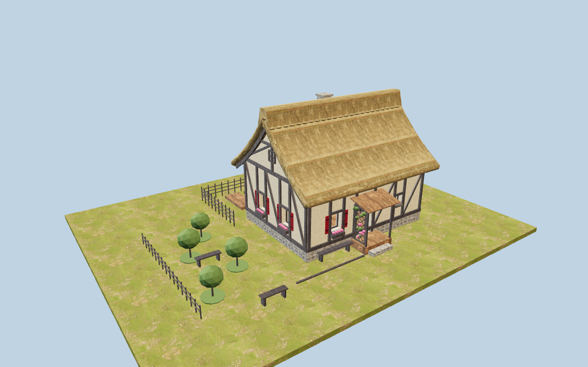
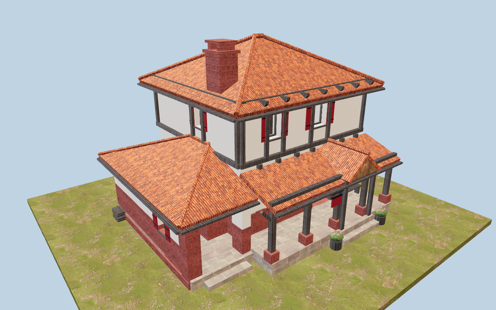
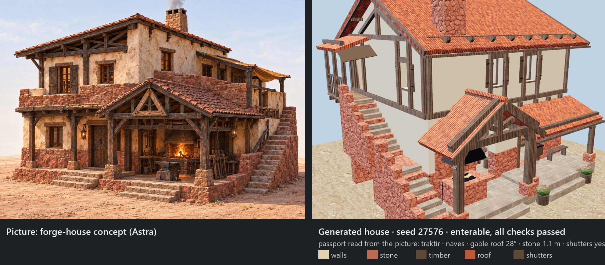
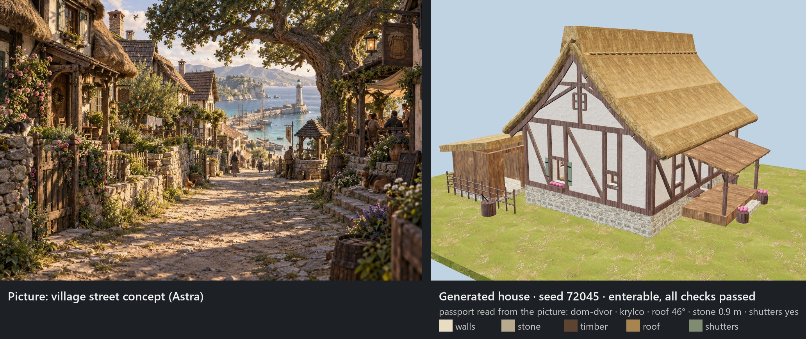

# Lived-in Houses

**A rule-based generator of enterable village houses — floor plans, rooms, furniture and gameplay checks — for games.**
Export to glTF in seconds, look inside in the browser, or build straight into Unreal Engine 5.

> *"A house becomes interesting when its layout lets you imagine the life inside."* — Astra, our AI art-direction assistant

[Русская версия](README.ru.md) · **[Live demo — open a house in your browser](https://bandurchencko.github.io/lived-in-houses/)** · **[Trailer, 50 s](https://bandurchencko.github.io/lived-in-houses/lived-in-houses.mp4)**

**Version 0.3.2** (28 September 2026) — a house from your picture, textured browser demo, gable roofs, volumetric stone, yard trades. [What changed](CHANGELOG.md).

## In one minute

- **Who it is for:** game developers and modders who need *villages you can walk into* — RPGs, life sims, town builders,
  level blockouts, AI/NPC experiments — and do not have months for hand-modelling every house.
- **The problem it solves:** AI image-to-3D gives beautiful statues with nothing inside; procedural cities give boxes;
  asset packs give the same twenty houses. This builds a whole house with rooms, doors, stairs, furniture and a yard in
  about a second — and checks that a character can actually walk through it.
- **How to use it:** open the [live demo](https://bandurchencko.github.io/lived-in-houses/) (no install) → or
  `pip install -r requirements.txt` and export a house to glTF for Unreal, Unity, Godot or Blender → or show it your own
  picture and get the nearest house it knows (`python -m generator_domov.obraz my-house.jpg`).
- **What's next:** we develop it together with our game — new families and styles as our villages need them — and we
  will keep publishing the tools we make along the way.

| Tavern with forge, seed 13 | Cut at 3.3 m: the ground floor inside |
|---|---|
|  |  |
| **Thatched garden house, seed 1818** | **Tavern, seed 7 — another composition** |
|  |  |

## Why we built it

We are making a fairy-tale world where people, NPCs and AI characters **live inside** the houses. A house there is not a
backdrop: you open the door, walk into the hall, sit at the table by the hearth, climb the stairs to the bedroom. So
every house needs a real inside — rooms that make sense, doors a character fits through, stairs you can actually climb.

We tried everything we could find before writing our own:

- **AI image-to-3D** (Tripo, TRELLIS.2, Hunyuan3D). A beautiful house in a minute — but it is a statue: solid inside,
  no rooms, the door is painted on. You cannot walk in.
- **The engine's procedural city** (Unreal PCG, City Sample). Streets and facades in seconds — but boxes, no interiors,
  and nothing like a village where you can feel how people live.
- **Ready-made asset packs.** Great quality, but ten to thirty fixed houses: the whole world starts to look copy-pasted,
  interiors are often empty, and the style is someone else's.
- **Building by hand** from our own modules. Beautiful and exactly our style — but days per house. We once spent two days
  on three houses.

So we wrote a program that **knows how a house is arranged**: which rooms a tavern or a family home needs, where the
hearth and the table go, how the stairs climb, where the windows look — and that **checks itself** (a character reaches
every room, the stairs are walkable, nothing blocks a window). The look is set by numbers taken from concept art —
plinth height, window sizes, roof pitch, materials — and every seed gives a new house in the same style. One house takes
about a second to glTF and 8–30 seconds into Unreal.

### When it helps

- **An RPG, a life sim or a town builder** where players and NPCs go inside: taverns, homes, workshops, forges.
- **Fast level blockouts with real interiors** — test movement, cameras and quests in houses that already pass
  walkability checks.
- **AI agents and NPC experiments** that need rooms to live in and navigate.
- **Variety for a small team** — dozens of distinct houses in one style without modelling each by hand.
- **Learning procedural architecture** — the rules are plain code you can read and change.

It is not the best tool for photoreal hero buildings (an artist will do better), modern cities (see City Sample) or single
props (AI generators and asset packs are faster there).

### Why take it

Free (MIT). Interiors and gameplay checks out of the box. glTF works in Unreal, Unity, Godot and Blender. Your own style
is a set of numbers, not a new art pipeline. Two families to start — and the way to add more is right in the code.

## What it does

Give it a family, a seed and a style — it builds a whole house you can walk into:

1. **Passport** — the seed picks numbers inside the style's ranges (plinth height, window sizes, roof pitch, eaves…) and
   a composition (the tavern has four: *gallery*, *annex*, *corner*, *canopy*) and a roof (*hip* or *gable* with
   half-timbered gable ends).
2. **Floor plan** — rooms by programme (hall with a hearth and a common table, kitchen, bedrooms, storeroom, workshop or
   forge), doors, windows, stairs, porch, gallery, yard, shed, garden.
3. **Details without an engine** — walls with openings, floors, ceilings, roof planes, timber frame, windows with
   shutters, eave tiles or thatch, live stone (larger protruding corner stones, an uneven top course, stair
   parapets with cap stones, boulders at the foot), furniture and small props — grouped as *shell / partitions / floors / roof / furniture
   / props* (separate meshes, so lighting inside stays clean).
4. **Checks** — a character capsule reaches every room through every door, stairs are walkable (≤ 38°, riser ≤ 0.19 m,
   tread ≥ 0.27 m), doors ≥ 0.95 m, living rooms have windows, the hearth and the table are seen from the entrance,
   nothing blocks a window.
5. **Output** — glTF/GLB in about a second (this repository), or an Unreal Engine 5 build in 8–30 s per house (the
   engine-side builder we use in our game; see *Unreal* below).

Two families today: **tavern with forge** (four compositions) and **house with a yard** (porch, garden or workshop;
shed, beds, wattle fence; by place — a stable under the canopy, beehives in the garden, a poultry coop), in two styles — **red stone** (lime plaster, dark timber, terracotta tiles) and **thatched
cottage** (cream clay, dark half-timbering, thick thatch). All seven examples pass all of their checks.

## From a picture to a house: who does what

The generator itself does not look at pictures. It reads a **passport**: the family (tavern, house with a yard), the parts
(porch, garden, workshop, gallery) and the **style numbers** — plinth height, window sizes, roof type and pitch, eaves,
materials and colours. Pictures come in one step earlier:

1. **You show a reference** — a photo, a sketch, a concept painting — to an art director. For us that is Astra (an AI
   that can see images) together with the owner; it can just as well be you, or any AI that reads images.
2. **The art director turns the picture into numbers**: "red stone plinth 0.6–0.9 m, windows 0.65–0.95 m with shutters,
   hip roof at 22–30°, a gallery along the front". That is the style file (`stil_mangala.py` is our example).
3. **The generator builds as many houses as you like in that style** — every seed a new one, every one with a real
   interior and passing its checks. A second per house.
4. **You look** (the browser viewer or your engine) and say what is off — and the numbers change, not the houses.
5. *(next releases)* **The settlement planner** places the houses along streets, around a square, on terraces.

### A house from your picture

Now the picture step is a command too. The **eyes** — an AI that can see images — read the picture into a passport, and
the generator builds the nearest house it knows: with a real interior, passing its checks, in the picture's colours.

```bash
python -m generator_domov.obraz my-house.jpg --glaza=vruchnuyu   # free: paste the printed prompt and the picture into any chat AI
python -m generator_domov.obraz my-house.jpg --glaza=claude      # automatic: Claude Code (your Claude subscription)
python -m generator_domov.obraz my-house.jpg --glaza=ollama      # free and offline: a local vision model via Ollama (experimental)
python -m generator_domov.obraz my-house.jpg --glaza=api         # automatic: an Anthropic API key, cents per picture (experimental)
```

You get `rab/obraz/<name>/<name>-dom.glb`, the passport the AI read and the check report. Drop the `.glb` onto the
[live page](https://bandurchencko.github.io/lived-in-houses/) to look around it and inside it. **The generator itself
needs no AI, no internet and no subscription** — only the picture step needs eyes, and free eyes work.




Two honest limits: the generator builds only what its rules know (a photo of a cathedral gives the nearest house it
knows, in the cathedral's colours and proportions — not the cathedral), and the inside of a house is never in a picture: the generator invents a believable
interior by its rules. That is the difference from image-to-3D AI: those copy the outer shape and give you a statue;
this one follows the picture's style and gives you a house you can live in.

## Engines, formats, requirements

| | |
|---|---|
| **Runs on** | Python (tested on 3.13) with `numpy`, `trimesh`, `pillow`; `pytest` for the tests. No engine needed to generate. |
| **Main output** | **glTF 2.0 binary (`.glb`)** — metres, Y-up, entrance facing −Z; one node per group (*shell, partitions, floors, roof, furniture, props, greenery, ground*) so you can hide the roof or the walls; PBR materials per material slot (base colour, roughness, metallic, glowing embers in the hearth). About 13–20 thousand triangles and under 1 MB per house. |
| **Also** | JSON of every stage — passport, plan (rooms, doors, stairs, parts), the list of details, the check results (`python -m generator_domov dom …`); plan sheets as images. |
| **Unreal Engine 5** | Drag the `.glb` into the Content Browser (glTF import). In our own game a native builder turns the same details into Unreal meshes with Geometry Script — one mesh per group, textured materials, lights — 8–30 s per house (UE 5.8; not in this first release). |
| **Unity** | Import the `.glb` with the official glTFast package. |
| **Godot 4** | Drop the `.glb` into the project — imported natively. |
| **Blender** | File → Import → glTF 2.0. |
| **Web** | `docs/index.html` — a three.js viewer (the live demo above). |
| **Your own engine** | The detail list is engine-free JSON of simple solids (boxes, walls with openings, beams, roof planes, profiles, cylinders, spheres, windows, eave tiles) — a builder for any engine is a few hundred lines. |

**Textures:** the `.glb` carries UVs (metres, laid along each face — tiles run along the eaves, stones in courses) and flat PBR colours; the viewer dresses it with CC0 textures from [Poly Haven](https://polyhaven.com) — stone, plaster, timber, tiles, thatch, paving — tinted to the house's colours, and lights it with a CC0 sky (`docs/tekstury/`). **Not there yet:** textures embedded in the `.glb`, LODs, only two families.

## Quick start

```bash
pip install -r requirements.txt
python -m pytest generator_domov -q                  # 333 tests, ~2 s
python primery.py                                    # rebuild the examples into docs/glb
python -m generator_domov.eksport_glb traktir 13 --kompoz=galereya --vyhod=tavern.glb
python -m generator_domov.eksport_glb dom-dvor 1818 --chast=sad --sad=jug --stil=kolybel --vyhod=garden-house.glb
python -m http.server 8000 --directory docs          # then open http://localhost:8000
```

Open any `.glb` in Blender, in Unreal (drag and drop) or in the viewer: toggle the roof and the walls, slide the cut
height to look inside each floor.

In Python:

```python
from generator_domov import traktir, dom_dvor
from generator_domov.proverki import proverit
from generator_domov.eksport_glb import dom_v_glb

passport, plan, details = traktir.sobrat(13, 'galereya')      # family, seed, composition
print(all(c['ok'] for c in proverit(passport, plan, details)))  # every check passed?
dom_v_glb(details, 'tavern.glb', 'mangala', True, plan=plan)
```

## A note on the code

The code is written in Russian transliteration (`sobrat` = build, `plan`, `detali` = details, `proverki` = checks,
`krysha` = roof, `traktir` = tavern, `dom_dvor` = house with a yard) and its comments are in Russian: it is the working
code of our game, published as it is. The pipeline above is the map; each module starts with a docstring describing it.

| Module | What it is |
|---|---|
| `detali.py` | Engine-free detail records: boxes, walls with openings, beams, roof planes, profiles, cylinders, spheres |
| `traktir.py` | Tavern with forge: passport, four compositions, rooms, furniture, forge |
| `dom_dvor.py` | House with a yard: porch / garden / workshop, shed, beds, fence; styles |
| `stil_mangala.py` | Style numbers of the red-stone architecture and room programmes |
| `proverki.py` | Gameplay checks (walkability, stairs, doors, windows, views) |
| `list_doma.py` | Plan sheets (PNG) |
| `eksport_glb.py` | Details → glTF (GLB), grouped nodes, style colours |
| `docs/index.html` | The browser viewer (three.js) |

## Unreal

In our game the same detail records are built in Unreal Engine 5.8 by a Python builder with Geometry Script: one mesh
per group, lights at the hearth, lamps and windows, 8–30 s per house, placed on terrain by our settlement planner.
That builder depends on our project's materials and is not part of this first release; the GLB path imports into
Unreal directly.

## Prior art — we are not the first

Rule-based buildings with interiors are an old idea, and we stand on these shoulders (we found most of them *after*
building ours — a lesson we took): Merrell et al. 2010 (room programme → floor plan → house), Lopes et al. 2010,
Tutenel et al. 2011, Emilien et al. 2012 (villages on terrain), Daggerfall, Shadows of Doubt, THE FINALS,
[Infinigen Indoors](https://github.com/princeton-vl/infinigen), [ProcTHOR](https://github.com/allenai/procthor),
[Procedural-Cities](https://github.com/magnificus/Procedural-Cities), [Veloren](https://veloren.net/),
[watabou's generators](https://watabou.itch.io/). What we have not found ready-made is this combination as an open tool
for UE5: rural houses with a household (hearth, forge, yard, shed, garden, gallery) by seed, gameplay checks on every
house, and a village planner on real terrain around them (coming in the next releases).

## How it was made

After several days of searching, we built a working generator in one night. The owner set the image and accepted the
result; Claude (Anthropic) implemented the rules; Astra analysed the composition.

- **Oleksandr Bandurchenko** — owner, direction, acceptance
- **Claude** (Anthropic, via Claude Code) — implementation
- **Astra** — AI assistant for art direction and visual review

Part of **Сад миров · Garden of Worlds**, a fairy-tale realistic world we are building in Unreal Engine 5
([YouTube @sadmirov](https://www.youtube.com/@sadmirov), [Telegram](https://t.me/sadmirov)).

## Next

Shared yards and streets → a whole village on two different sites → villages on hillside terraces. Two families today;
more will come as the game needs them.

## License

MIT — see [LICENSE](LICENSE). Textures and the sky in `docs/tekstury/` are from [Poly Haven](https://polyhaven.com), CC0.
